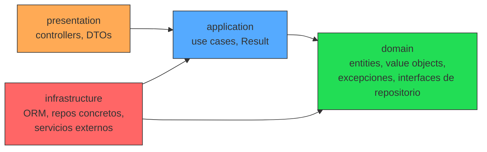

# Arquitectura

## Regla de dependencia

Clean Architecture en este proyecto significa una cosa concreta y verificable:
**las dependencias de código solo pueden apuntar hacia adentro.**



- **`domain`** no importa nada de `application`, `infrastructure` ni `presentation`. Es
  TypeScript puro: sin `@nestjs/*`, sin ORM, sin HTTP. Se testea sin levantar nada.
- **`application`** orquesta entidades de `domain` a través de interfaces (puertos)
  definidas en `domain`. No conoce Express, no conoce el ORM concreto.
- **`infrastructure`** implementa las interfaces que `domain`/`application` declaran
  (ej: `UserRepository` interface en domain, `SequelizeUserRepository` en infrastructure).
- **`presentation`** es el único punto de contacto con HTTP. Los controllers son
  adaptadores delgados: reciben la petición, llaman un caso de uso, devuelven la
  respuesta. Cero lógica de negocio ahí.

Esta regla **no es solo un acuerdo de equipo**: está forzada por ESLint
(`no-restricted-imports` en `.eslintrc.js`, sección `overrides`). Si alguien importa
`infrastructure` desde `domain`, el build falla — no depende de que el reviewer se dé
cuenta en el PR.

## Por qué `no-restricted-imports` y no un plugin de arquitectura

Se evaluó `eslint-plugin-boundaries`, pero su versión más reciente (v7) tiene una API
distinta a la documentada y en la práctica **no bloqueaba las violaciones de prueba**
en este proyecto — un lint en verde que no protege nada es peor que no tener la regla,
porque genera falsa confianza. Se optó por la regla nativa `no-restricted-imports` de
ESLint: cero dependencias externas, comportamiento 100% predecible, y se verificó
manualmente que sí bloquea las tres direcciones prohibidas (domain→application,
application→infrastructure/presentation, infrastructure→presentation).

## Bloques base compartidos (`src/shared`)

| Archivo | Capa | Qué resuelve |
|---|---|---|
| `Entity<Props>` | domain | Identidad por `id`, no por atributos |
| `AggregateRoot<Props>` | domain | Entidad raíz + acumulación de domain events |
| `ValueObject<Props>` | domain | Igualdad estructural, inmutable |
| `UniqueEntityId` | domain | UUID tipado, no strings sueltos |
| `DomainException` (+ subclases) | domain | Errores de negocio desacoplados de HTTP |
| `Result<T, E>` | application | Éxito/error explícito sin excepciones para flujo esperado |
| `UseCase<Req, Res>` | application | Contrato único para todos los casos de uso |

## Primer módulo migrado: `health`

`health` no tiene entidades de negocio (no hay "cosa" que persista), así que no
tiene carpeta `domain/` propia — eso es correcto, no todo módulo necesita las
cuatro capas. Lo que sí demuestra es el patrón `presentation → application`:

```
src/modules/health/
├── application/
│   ├── check-system-health.use-case.ts   # orquesta los indicadores de Terminus
│   └── check-system-health.use-case.spec.ts
├── presentation/
│   └── controllers/
│       ├── health.controller.ts          # adaptador HTTP delgado
│       └── health.controller.spec.ts
└── health.module.ts
```

## Próximos módulos (Fase 3 en adelante)

`users`, `auth`, `roles`, `permissions` y `audit` sí tendrán las cuatro capas
completas, con `domain/` conteniendo la entidad `User` (o `Role`, etc.), sus Value
Objects (`Email`, `Password`) y la interfaz `UserRepository`; `infrastructure/`
con la implementación concreta sobre PostgreSQL.
